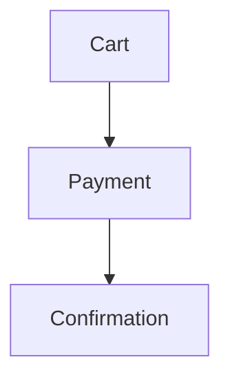

# Checkout behavior spec

## Diagram



## Behavior

```gherkin
Feature: Checkout
  Scenario: successful card payment
    Given a shopper has items in their cart
    When they submit a valid card payment
    Then the order confirmation is shown
```
